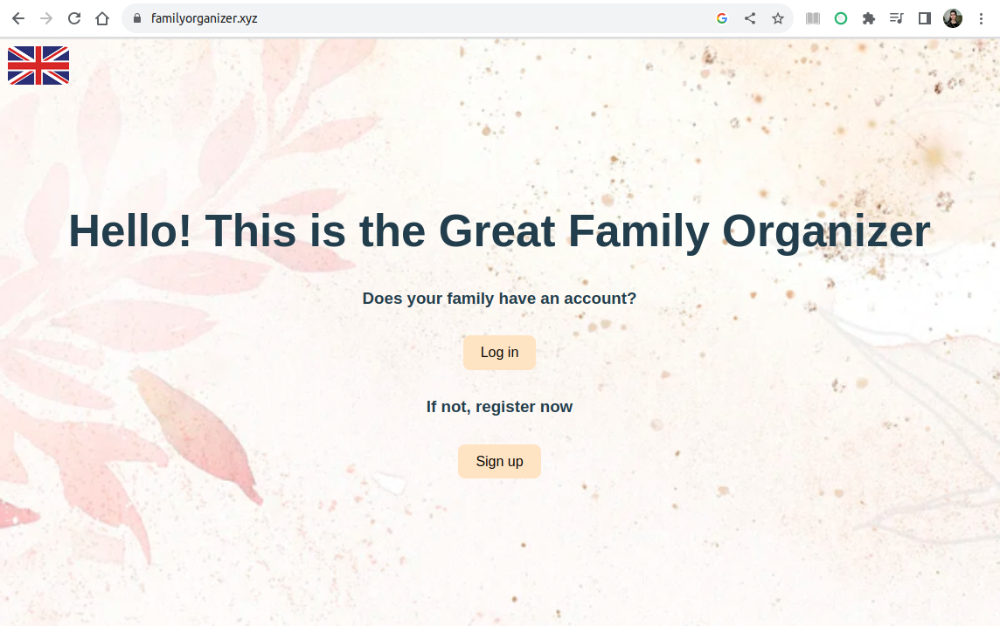
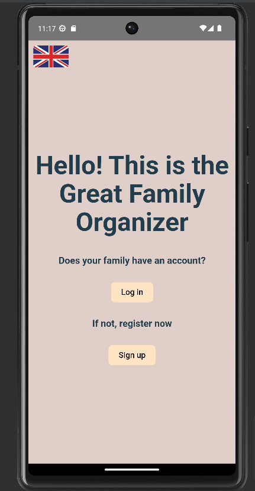
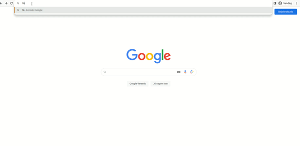
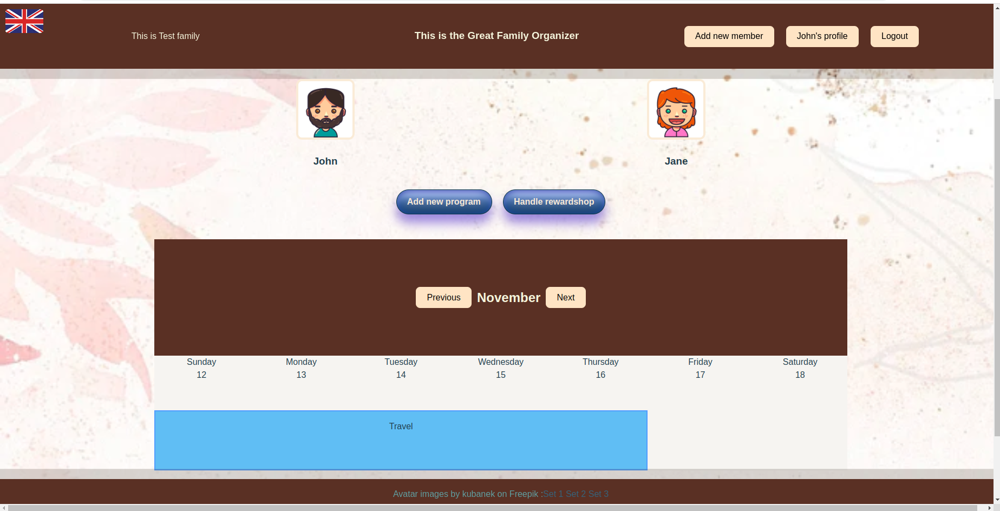
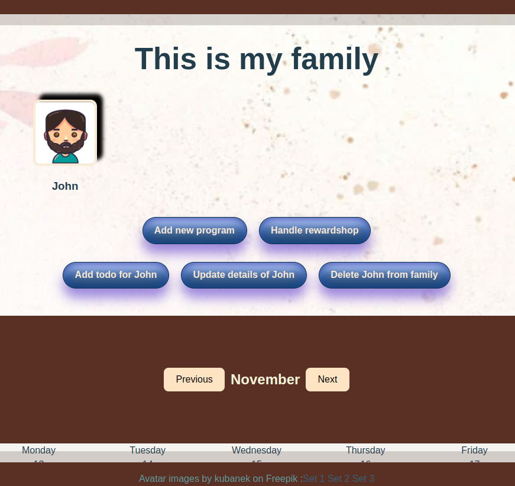

# OrganizeYourFamiliy
Planner and organizer 

## Table of Contents
1.[Description](https://github.com/Citrom333/OrganizeYourFamily#description)</br>
2.[Tech stack](https://github.com/Citrom333/OrganizeYourFamily#tech-stack)</br>
3.[How to Install and Run the App](https://github.com/Citrom333/OrganizeYourFamily#how-to-install-and-run-the-app)</br>
4.[Run from browser](https://github.com/Citrom333/OrganizeYourFamily#a-easiest-way---follow-this-link-httpsfamilyorganizerxyz)</br>
5.[Run from local machine](https://github.com/Citrom333/OrganizeYourFamily#b-run-in-localhost-on-your-machine)</br>
6.[Run from device](https://github.com/Citrom333/OrganizeYourFamily#c-run-from-emulator-or-your-own-mobile-device-android)</br>
7.[How to Use the Project](https://github.com/Citrom333/OrganizeYourFamily#how-to-use-the-project)

## Description
It is a web application for scheduling programs, and planning tasks for family members. It has a rewarding system for motivating. 
You can use web application or mobile application.


| Web app                                                                                                 | Mobile app                                                                                              |
|---------------------------------------------------------------------------------------------------------|---------------------------------------------------------------------------------------------------------|
|  |  |


## Tech stack
- Database: MSSQL
- Backend: ASP.Net C# with Entity Framework
- Frontend: React Vite (javascript) 
###
- Mobile application: </br>
    The mobile version was created with [Capacitor framework (by Ionic)](https://capacitorjs.com/).</br> 
    If you would like to try it on your projects, let me advice you [THIS](https://www.youtube.com/watch?v=IwHt_QpIa8A&t=1183s) tutorial.
  

## How to Install and Run the App


### a) Easiest way - follow this link: https://familyorganizer.xyz
The application is deployed, so you can simply use it from your browser.</br>
##



### b) Run in localhost, on your machine
For this, you will need docker, and docker compose on your machine.</br>
###
Clone the main branch from repository.
```
git clone https://github.com/Citrom333/OrganizeYourFamily.git
```
Then run these commands:
```
docker-compose build
docker-compose up
```
Now the app is running from localhost. You can open it in your browser.  http://localhost:5100/


### c) Run from emulator or your own mobile device (Android)
First you'll need to clone the AppForMobile branch from repository. Run the following command in your terminal: </br>
```
git clone -b AppForMobile https://github.com/Citrom333/OrganizeYourFamily.git
```
</br>Install dependencies. From the OrganizeYourFamily/frontend folder run: 
```
npm i
```
Build your project, and update capacitor.
```
npm run build
npx cap sync
```
For the next step you will need Android Studio on your machine. (https://developer.android.com/studio).</br>
If you would like to run the app from emulator, add SDK (min. 22) and a virtual device. 
</br>
```
npx cap open android
```
This will open Android Studio, where you can run the application. (You can choose virtual or physical device.)


## How to Use the Project
All you need is to sign up with your family, and after logging in you can add family members.
</br>Adults and children have different rights. </br>
For example as an adult, you can add new member, or update any member.

|                                                                                                  |                                                                                                |
|---------------------------------------------------------------------------------------------------------|---------------------------------------------------------------------------------------------------------|
|  | |

The children can gain reward points for their finished tasks, and they can spend it in the rewardshop.
The adults can define what are these rewards.

